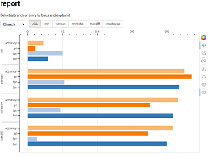
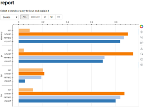
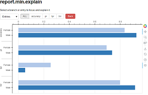

# Explore reports

Here we describe how to explore reports or other complex
objects created with FairBench. These objects are organized
as forks (reports are also forks) whose branches correspond to
column names. The main mechanism to access parts of reports
is the perspective notation below. For example, you can write
`report.minratio` to obtain a Fork of all minimum ratio reductions
for all base measures, `report.auc` to obtain all the reductions
for the base auc measure, and
`report.auc.minratio` to obtain the (explainable) value of the
minratio reduction for auc. 
Once you get a hang of how perspectives can be obtained, you
can explore reports or comparisons of reports across
different algorithms and classes programmatically.
You can also perform the exploration via an
interactive visual interface
that lets you navigate between various perspectives.

## Perspectives

To delve into complicated comparisons between
subgroups, you need to understand the concept 
of report perspectives. Viewing all values stored in a branch
is one perspective (e.g., `report.min` to view 
assessments for the worst metric values for that
branch).
But you can also obtain other perspectives, like viewing
all values for the same entry in all branches
(e.g., `report.tpr` to view true positive
rates across all branches).
Perspectives are equivalent to a combination of 
tensor access alongside a specific dimension.


## Explainable values

Some report values can be explained 
in terms of data they are derived from.
For instance, if a `fairbench.isecreport` is made, both
empirical and bayesian evaluations arise from the underlying
data branches of multi-attribute fairness forks. More 
on exploration based on explainable objects can be found in
our introduction to programmatic [interactive exporation](interactive.md)

Whenever possible, the data branches that are converted
into final reports are preserved by having report values
be instances of the `Explainable` class.
This provides an `.explain` field of data contributing
to the report value, and `.desc` field to store additional 
descriptions. You can perform arithmetic operations
between explainable objects and other numbers and the
outcome will be normal python numbers.

<button onclick="toggleCode('explain')" class="toggle-button">>></button>
As an example, you can use these fields
to retrieve posterior estimations contributing to
calculating the *baysian* branch of the minprule
metric in the *isecreport*. 


<div id="explain" class="code-block" style="display:none;">

```python
report = fb.isecreport(vals)
fb.describe(report)
fb.describe(report.bayesian.minprule.explain)

Metric          empirical       bayesian       
minprule        0.857           0.853          

Metric          case1           case2           case2,case1    
                0.729           0.706           0.827     
```

</div>


## Compare reports

To compare the same type of reports produced by two different
algorithms, you need to create a fork with the reports as its
branches. Any number of algorithms or classes of the same
algorithm can be assessed with
a FairBench reporting mechanism and combined into a fork.
Then, view the fork under some perspective to 
simplify it. The pattern to do so is:

```python
import fairbench as fb
reportAlg1 = ...  # a report
reportAlg2 = ...  # a report
property = ...   # a property (e.g., row or column of the report) to focus on
reports = {"al1": reportAlg1, "alg2": reportAlg2} # with the dict you can also create the reports incrementally
fb = fb.Fork(reports)
fb.describe(fb[property]) 
```

<button onclick="toggleCode('pygrank')" class="toggle-button">>></button>
For example, employ 
[pygrank](https://github.com/MKLab-ITI/pygrank)
to run both a normal pagerank algorithm and a fairness-aware adaptation
for node recommendation. Use the recommendation outcomes
by those algorithms
to produced two reports (e.g., multireports)
and create a fork of them, each corresponding to a different
algorithm. Then obtain some perspective of the complicated
fork to describe visualize,
such as all the reductions of the auc base measure. 
This will essentially
compare the reductions between the two algorithms. 

<div id="pygrank" class="code-block" style="display:none;">

```python
import pygrank as pg
import fairbench as fb

"""load data and set sensitive attribute"""
_, graph, communities = next(pg.load_datasets_multiple_communities(["highschool"]))
train, test = pg.split(pg.to_signal(graph, communities[0]), 0.5)
sensitive_signal = pg.to_signal(graph, communities[1])
labels = test.filter(exclude=train)
sensitive = fb.Fork(gender=fb.categories@sensitive_signal.filter(exclude=train))

"""create report for pagerank"""
algorithm = pg.PageRank(alpha=0.85)
scores = algorithm(train).filter(exclude=train)
report = fb.multireport(labels=labels, scores=scores, sensitive=sensitive)

"""create report for locally fair pagerank"""
fair_algorithm = pg.LFPR(alpha=0.85, redistributor="original")
fair_scores = fair_algorithm(train, sensitive=sensitive_signal).filter(exclude=train)
fair_report = fb.multireport(labels=labels, scores=fair_scores, sensitive=sensitive)

"""combine both reports into one and get the auc perspective"""
fork = fb.Fork(ppr=report, lfpr=fair_report)
fb.describe(fork.auc)

Metric          ppr             lfpr           
min             0.680           0.589          
wmean           0.780           0.743          
gini            0.058           0.095          
minratio        0.792           0.681          
maxdiff         0.178           0.276          
maxbarea        0.169           0.262          
maxrarea        0.247           0.302          
maxbdcg         0.184           0.276         
```

</div>


<button onclick="toggleCode('multiclass')" class="toggle-button">>></button>
A fork of reports can also hold multiclass data by making
each fork branch correspond to a different class. You can not describe
or visualize the created fork directly because it is too complex, 
but you can view parts of it that are simple enough.

<div id="multiclass" class="code-block" style="display:none;">

```python
import matplotlib.pyplot as plt
import fairbench as fb
reportA = fb.multireport(...)  # generate a report for class A
reportB = fb.multireport(...)  # generate the same report for class B
multiclass = fb.Fork(A=reportA, B=reportB)
fb.describe(muilticlass.minratio)  # compare the minratio reductions between classes
```

</div>


## Interactive visualization

To start interactive visualization, call the snippet below
on an object that is a dictionary or fork. 
The call shows the default values for 
optional arguments, which set a report name to be displayed
and whether plots should be horizontally or vertically aligned.
Horizontal alignment lets figures remain
comprehensive during complex intersectional analysis.

```python
import fairbench as fb

obj = ...  # the object to explore (e.g., a  report)
fb.interactive(obj, name="report", horizontal=True)
```

When run in a console, the above code will start a bokeh server
that hosts a dynamic web page and will open the latter
as a tab in your local browser (hard-terminate
the process with ctrl+C to stop the server). When run in a 
Jupyter environment, a bokeh application will
start on the next output cell instead.

!!! info 
    When Jupyter runs on its non-default port,
    add a respective argument (e.g., `port=8889`)
    to interactive visualization to set appropriate permissions.


Interactive visualization starts from the top level of 
forks/reports and looks like the figures below. Figures
will appear only if data objects can be visualized. 
The first menu option over the figure controls whether 
to explore data by branches or entries. In the example
below, this means by reduction strategy over subgroups 
or performance metric.




You can focus on a specific branch or entry by clicking on its name 
on buttons over the figure. This will generate the appropriate perspective,
as shown below. Two new options are added: a button to go back to the 
previous perspective and an button to create an explanation perspective.
This last button appears only when you focus on specific branches or entries.
The current perspective always appears on the top. Currently, we are investigating
the minimum reduction strategy of the report. Hover over a bar to view its
exact values.


Let us now view the explanations of what quantities have led to 
computing the values of the current figure by clicking on the explain button.
The report we are exploring (multireport) 
performs reduction on the outcome of performance metrics on each
sensitive attribute branch, i.e., sensitive attribute dimension.
Thus, explanations consist of metric outcomes. Similarly to before, 
you can switch between showing branches and entries of explanation
values.




!!! tip 
    FairBench keeps track of metadata when computing base performance 
    metrics, and you can eventually view them and compare them 
    from within interactive visualization as explanations. For example,
    below is the explanation for ''true positive rates of the minimum
    reduction's explanation'', as indicated by reading the perspective's 
    title `report.min.explain.tpr.explain` from end to start.
    By looking at base metric explanations, you can get a feel
    for raw data properties and corresponding systemic, societal,
    or data gathering issues
    that eventually give rise to bias.<br><br>
    


<script>
function toggleCode(id) {
    var codeBlock = document.getElementById(id);
    if (codeBlock.style.display === "none") {
        codeBlock.style.display = "block";
    } else {
        codeBlock.style.display = "none";
    }
}
</script>
